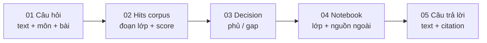
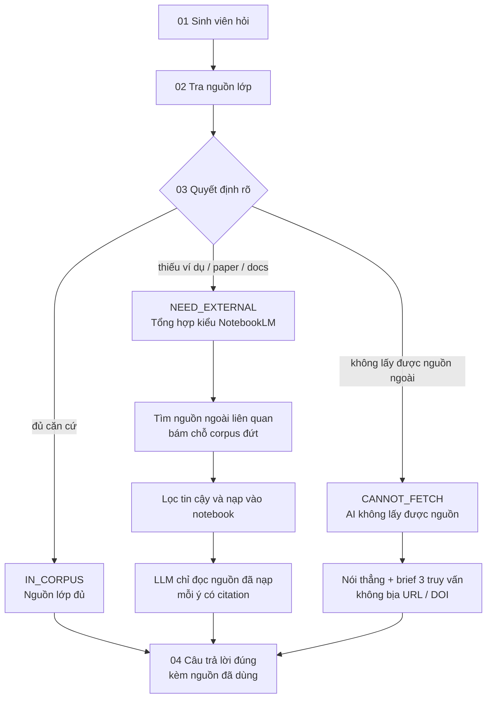

# Checkpoint 2 · Luồng hoạt động

**VLearn Extend** — Mini Hackathon AI

Giống NotebookLM: khi nguồn lớp không đủ, hệ thống tìm và nạp nguồn ngoài liên quan đến câu hỏi, rồi tổng hợp để trả lời đúng, có căn cứ.

Cách đọc: dữ liệu đi từ trái sang phải. Ba nhánh là một quyết định rõ — LLM không được bịa nguồn. Nhánh giữa là phần giống NotebookLM.

---

## 1. Luồng dữ liệu

| Bước | Dữ liệu | Nội dung |
| --- | --- | --- |
| 01 | Câu hỏi | text + môn + bài |
| 02 | Hits corpus | đoạn lớp + score |
| 03 | Decision | phủ / gap |
| 04 | Notebook | lớp + nguồn ngoài |
| 05 | Câu trả lời | text + citation |

---

## 2. Luồng hoạt động

### 01 · Sinh viên hỏi

Câu hỏi khi ôn quiz, hiểu khái niệm hoặc làm đồ án. Kèm ngữ cảnh môn / bài đang học.

### 02 · Tra nguồn lớp

Tìm trong `data/` được phép: slide, giáo trình, transcript. Lấy đoạn liên quan và đo độ phủ.

### 03 · Quyết định rõ

- Đủ căn cứ → **IN_CORPUS**
- Thiếu ví dụ / paper / docs → **NEED_EXTERNAL**
- Không lấy được nguồn ngoài → **CANNOT_FETCH**

### Ba nhánh

**IN_CORPUS — Nguồn lớp đủ**

Trả lời ngay từ corpus. Kèm tối đa 3 nguồn trong lớp. Không kéo thêm web.

**NEED_EXTERNAL — Tổng hợp kiểu NotebookLM**

Sinh truy vấn bám đúng chỗ corpus đứt — không search lung tung. Lọc nguồn tin cậy (docs chính thức, giáo trình mở, paper), rồi nạp vào notebook phiên hỏi.

LLM chỉ đọc nguồn đã nạp (lớp + ngoài). Mỗi ý có citation. Không bịa URL, DOI hay tên paper.

**CANNOT_FETCH — AI không lấy được nguồn**

Nói thẳng. Đưa brief 3 truy vấn + tiêu chí tin cậy để sinh viên tự tìm. Không giả vờ đã đọc nguồn ngoài.

### 04 · Đầu ra cho sinh viên

Câu trả lời đúng, kèm nguồn đã dùng.

Học viên nhận câu trả lời + danh sách nguồn (lớp / ngoài) + trạng thái quyết định. Ôn được tại chỗ, không phải nhảy Google một cách mù mờ, và biết rõ câu nào được grounded trên nguồn thật.

---

## 3. So với NotebookLM

| Giống NotebookLM | Khác NotebookLM |
| --- | --- |
| Câu trả lời chỉ được tổng hợp từ nguồn đã nạp vào notebook. Có citation từng ý. Không dùng kiến thức “trôi” để bịa tài liệu. | Sinh viên không phải tự đi gom hết nguồn. Khi lớp thiếu, hệ thống tìm nguồn ngoài liên quan đến câu hỏi; nếu không fetch được thì nói rõ, không giả vờ. |

Sơ đồ này chốt cách dữ liệu chạy: **corpus trước, nguồn ngoài sau, LLM chỉ nói trên nguồn đã nạp**.
